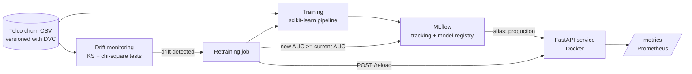
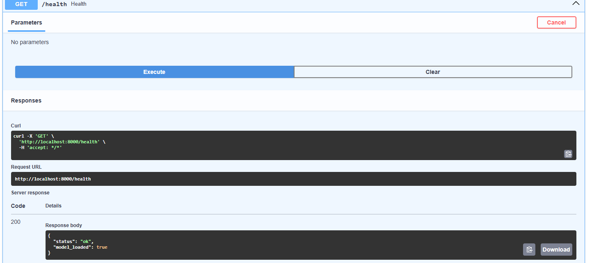
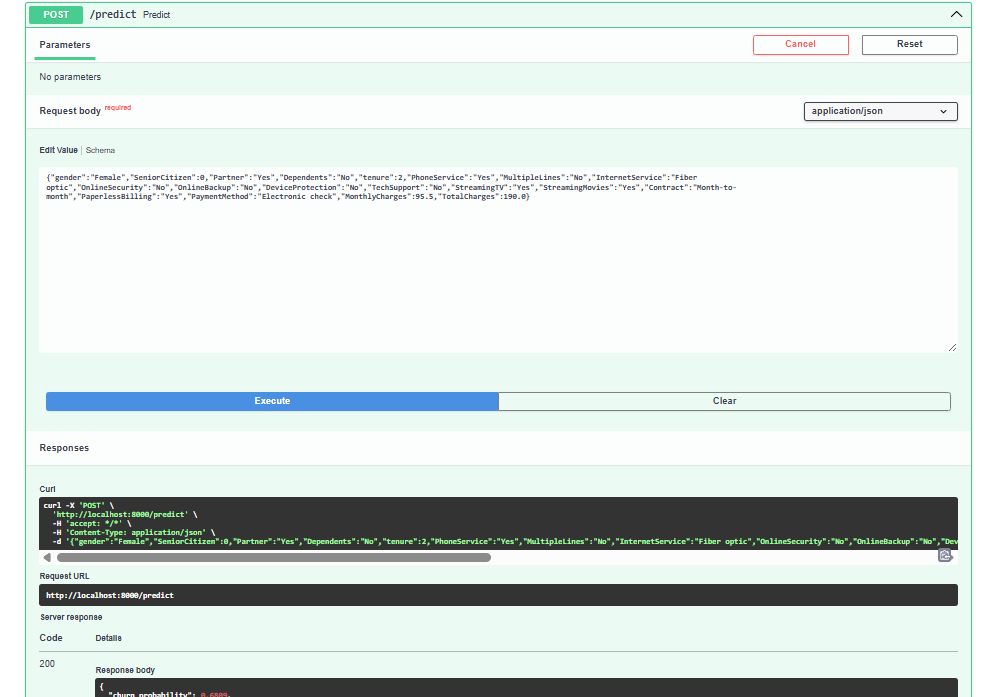

# MLOps Churn Platform

End-to-end MLOps pipeline for customer churn prediction: data versioning, experiment tracking, model registry, REST API serving, drift monitoring and automated retraining with safe model promotion.

## Architecture



## API demo

Interactive documentation served by FastAPI (`/docs`):

**Health check** – the production model is loaded:



**Prediction** – churn probability for one customer:



## Stack

| Layer | Tool |
|---|---|
| Data versioning | DVC |
| Model | scikit-learn (preprocessing + Random Forest in a single `Pipeline`) |
| Experiment tracking and registry | MLflow (SQLite backend, `production` alias) |
| Serving | FastAPI + Uvicorn, Docker |
| API monitoring | Prometheus metrics (`prometheus-fastapi-instrumentator`) |
| Drift detection | SciPy: Kolmogorov-Smirnov (numeric), chi-square (categorical) |
| Tests | pytest |

## Results

Trained on the Telco Customer Churn dataset (80/20 stratified split):

| Metric | Value |
|---|---|
| ROC AUC | 0.840 |
| F1 (churn class) | 0.532 |

## Project structure

```
src/
  train.py          # train, log params/metrics, register the model in MLflow
  promote.py        # set the `production` alias on a model version
  monitor.py        # per-column drift tests + dataset-level drift decision
  retrain.py        # drift check -> retrain -> promote only if not worse -> reload API
  api/main.py       # FastAPI service (/predict, /health, /reload, /metrics)
tests/
  test_api.py       # API smoke test (health + prediction)
  test_monitor.py   # drift detection unit tests
data/churn.csv.dvc  # DVC pointer to the dataset
```

## Quick start

### 1. Setup

```powershell
python -m venv .venv
.\.venv\Scripts\Activate.ps1
pip install -r requirements.txt
```

Get the dataset (DVC remote is local, so download the public Telco Customer Churn CSV) and save it as `data/churn.csv`.

### 2. Train and promote a model

```powershell
$env:MLFLOW_TRACKING_URI="sqlite:///mlflow.db"   # Linux/macOS: export MLFLOW_TRACKING_URI=sqlite:///mlflow.db
python -m src.train
python -m src.promote 1
```

Browse runs and the registry with `mlflow ui --backend-store-uri sqlite:///mlflow.db`.

### 3. Serve the model

```powershell
uvicorn src.api.main:app --port 8000
```

Open http://localhost:8000/docs. Example request:

```bash
curl -X POST http://localhost:8000/predict -H "Content-Type: application/json" -d '{
  "gender":"Female","SeniorCitizen":0,"Partner":"Yes","Dependents":"No","tenure":2,
  "PhoneService":"Yes","MultipleLines":"No","InternetService":"Fiber optic",
  "OnlineSecurity":"No","OnlineBackup":"No","DeviceProtection":"No","TechSupport":"No",
  "StreamingTV":"Yes","StreamingMovies":"Yes","Contract":"Month-to-month",
  "PaperlessBilling":"Yes","PaymentMethod":"Electronic check",
  "MonthlyCharges":95.5,"TotalCharges":190.0}'
# {"churn_probability": ..., "churn": ...}
```

| Endpoint | Purpose |
|---|---|
| `POST /predict` | Churn probability for one customer |
| `GET /health` | Service status and whether a model is loaded |
| `POST /reload` | Reload the current `production` model without restarting |
| `GET /metrics` | Prometheus metrics |

### 4. Docker

```powershell
docker build -t churn-api .
docker run -p 8000:8000 -v ${PWD}/data:/app/data churn-api
```

The container trains a model on startup, promotes it and starts the API.

### 5. Drift monitoring and retraining

```powershell
python -m src.monitor --simulate    # reports drifted columns, writes drift_report.json
python -m src.retrain --simulate    # drift -> retrain -> champion/challenger -> reload API
```

How it works:

- **Drift detection**: the data is split into a reference half and a current half. Each column is tested (KS for numeric, chi-square for categorical, p < 0.01). If more than 15% of columns drift, the dataset is flagged as drifted.
- **Retraining**: on drift, a new model is trained and registered. It is promoted to `production` only if its AUC is at least that of the current model, then the API reloads it through `/reload`.

### 6. Tests

```powershell
pytest -q
```

## Limitations

- Drift is **simulated** (`--simulate` shifts several columns). In production, the current window should come from logged API requests.
- Retraining reuses the same labelled CSV, so the mechanism is demonstrated, but the AUC does not improve. In production, retraining should use fresh labelled data.
- The DVC remote is a local folder. A shared remote (S3, GCS, SSH) would be needed for a team.
- The model is a Random Forest baseline. The focus of this project is the MLOps lifecycle, not model performance.

## Possible next steps

- Log live requests and compute drift on real traffic
- Scheduled retraining (cron / CI) and alerting on drift
- Prometheus + Grafana dashboard for API and drift metrics
- Cloud deployment and a remote DVC storage